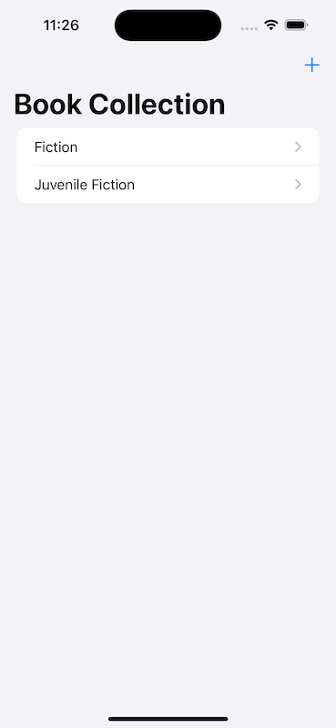

# Book Collection

## Overview
This project started as a reason to learn CoreData and SwiftUI.

## Components
- CoreData
- SwiftUI
- [CodeScanner](https://github.com/twostraws/CodeScanner)
- [Google Book Web Service API](https://developers.google.com/books/docs/v1/using#PerformingSearch)

## TO DO
- Complete unit tests
- UI redesign

## Screenshots

